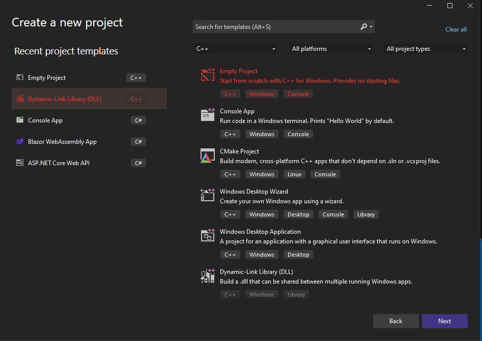

## Chimera Unlea$ed 

  

  

  
## Tool Background 

* * *

While DLL sideloading can be used for legitimate purposes, such as loading necessary libraries for a program to function, it can also be used for malicious purposes. Attackers can use DLL sideloading to execute arbitrary code on a target system, often by exploiting vulnerabilities in legitimate applications that are used to load DLLs.

To automate the DLL sideloading process and make it more effective, Chimera was created a tool that include evasion methodologies to bypass EDR/AV products. These tool can automatically encrypt a shellcode via XOR with a random key and create template Images that can be imported into Visual Studio to create a malicious DLL.

Also Dynamic Syscalls from SysWhispers2 is used and a modified assembly version to evade the pattern that the EDR search for, Random nop sleds are added and also registers are moved. Furthermore Early Bird Injection is also used to inject the shellcode in another process which the user can specify with Sandbox Evasion mechanisms like HardDisk check & if the process is being debugged. Finally Timing attack is placed in the loader which using waitable timers to delay the execution of the shellcode.

  

This tool has been tested and shown to be effective at bypassing EDR/AV products and executing arbitrary code on a target system.

  

## Tool Usage

* * *

Chimera  is written in python3  and there is no need to install any extra dependencies.

  

Chimera currently supports two DLL options either Microsoft teams or Microsoft OneDrive.

  

Someone can create userenv.dll which is a missing DLL from Microsoft Teams and insert it to the specific folder to 

`⁠%USERPROFILE%/Appdata/local/Microsoft/Teams/current`  

  
For Microsoft OneDrive the script uses version DLL which is common because its missing from the binary example onedriveupdater.exe

  
### Chimera Usage.

`python3 ./chimera.py met.bin chimera_automation notepad.exe teams`

`python3 ./chimera.py met.bin chimera_automation notepad.exe onedrive`

### Additional Options

* * *

- [x]  \[raw payload file\] : Path to file containing shellcode
- [x]  \[output path\] : Path to output the C template file
- [x]  \[process name\] : Name of process to inject shellcode into
- [x]  \[dll\_exports\] : Specify which DLL Exports you want to use either teams or onedrive
- [x]  \[replace shellcode variable name\] : \[Optional\] Replace shellcode variable name with a unique name
- [x]  \[replace xor encryption name\] : \[Optional\] Replace xor encryption name with a unique name
- [x]  \[replace key variable name\] : \[Optional\] Replace key variable name with a unique name
- [x]  \[replace sleep time via waitable timers\] : \[Optional\] Replace sleep time your own sleep time

  

### Usefull Note

Once the compilation process is complete, a DLL will be generated, which should include either "version.dll" for OneDrive or "userenv.dll" for Microsoft Teams. Next, it is necessary to rename the original DLLs.

For instance, the original "userenv.dll" should be renamed as "tmpB0F7.dll," while the original "version.dll" should be renamed as "tmp44BC.dll." Additionally, you have the option to modify the name of the proxy DLL as desired by altering the source code of the DLL exports instead of using the default script names.

## Visual Studio Project Setup

* * *

Step 1: Creating a New Visual Studio Project with DLL Template

1. Launch Visual Studio and click on "Create a new project" or go to "File" -> "New" -> "Project."
2. In the project templates window, select "Visual C++" from the left-hand side.
3. Choose "Empty Project" from the available templates.
4. Provide a suitable name and location for the project, then click "OK."
5. On the project properties window, navigate to "Configuration Properties" -> "General" and set the "Configuration Type" to "Dynamic Library (.dll)."
6. Configure other project settings as desired and save the project.

  

  

  

  

  

Step 2: Importing Images into the Visual Studio Project

1. Locate the "chimera\_automation" folder containing the necessary Images.
2. Open the folder and identify the following Images: main.c, syscalls.c, syscallsstubs.std.x64.asm.
3. In Visual Studio, right-click on the project in the "Solution Explorer" panel and select "Add" -> "Existing Item."
4. Browse to the location of each file (main.c, syscalls.c, syscallsstubs.std.x64.asm) and select them one by one. Click "Add" to import them into the project.
5. Create a folder named "header\_Images" within the project directory if it doesn't exist already.
6. Locate the "syscalls.h" header file in the "header\_Images" folder of the "chimera\_automation" directory.
7. Right-click on the "header\_Images" folder in Visual Studio's "Solution Explorer" panel and select "Add" -> "Existing Item."
8. Browse to the location of "syscalls.h" and select it. Click "Add" to import it into the project.

  

Step 3: Build Customization

1. In the project properties window, navigate to "Configuration Properties" -> "Build Customizations."
2. Click the "Build Customizations" button to open the build customization dialog.

  

Step 4: Enable MASM

1. In the build customization dialog, check the box next to "masm" to enable it.
2. Click "OK" to close the build customization dialog.

  
  
  
Step 5: 

1. Right click in the assembly file → properties and choose the following
2. Exclude from build → No
3. Content → Yes
4. Item type → Microsoft Macro Assembler

  
  
  

### Final Project Setup

  
  
  

## Compiler Optimizations 

* * *

Step 1: Change optimization 

1. In Visual Studio choose Project → properties 
2. C/C++ Optimization and change to the following

  

Step 2: Remove Debug Information's

1. In Visual Studio choose Project → properties 
2. Linker → Debugging → Generate Debug Info → No

  

## Liability Disclaimer:

* * *

_To the maximum extent permitted by applicable law, myself(George Sotiriadis) and/or affiliates who have submitted content to my repo, shall not be liable for any indirect, incidental, special, consequential or punitive damages, or any loss of profits or revenue, whether incurred directly or indirectly, or any loss of data, use, goodwill, or other intangible losses, resulting from (i) your access to this resource and/or inability to access this resource; (ii) any conduct or content of any third party referenced by this resource, including without limitation, any defamatory, offensive or illegal conduct or other users or third parties; (iii) any content obtained from this resource_

  

## References 

* * *

[https://www.ired.team/offensive-security/code-injection-process-injection/early-bird-apc-queue-code-injection](https://www.ired.team/offensive-security/code-injection-process-injection/early-bird-apc-queue-code-injection)

[https://evasions.checkpoint.com/](https://evasions.checkpoint.com/)

[https://github.com/Flangvik/SharpDllProxy](https://github.com/Flangvik/SharpDllProxy)

[https://github.com/jthuraisamy/SysWhispers2](https://github.com/jthuraisamy/SysWhispers2)

[https://systemweakness.com/on-disk-detection-bypass-avs-edr-s-using-syscalls-with-legacy-instruction-series-of-instructions-5c1f31d1af7d](https://systemweakness.com/on-disk-detection-bypass-avs-edr-s-using-syscalls-with-legacy-instruction-series-of-instructions-5c1f31d1af7d)

[https://github.com/Mr-Un1k0d3r](https://github.com/Mr-Un1k0d3r)
